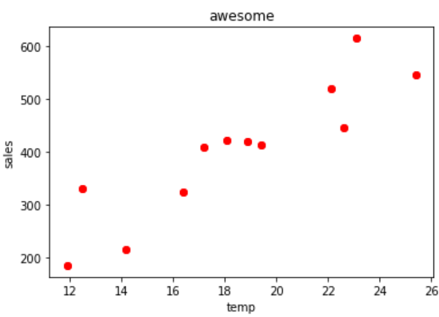
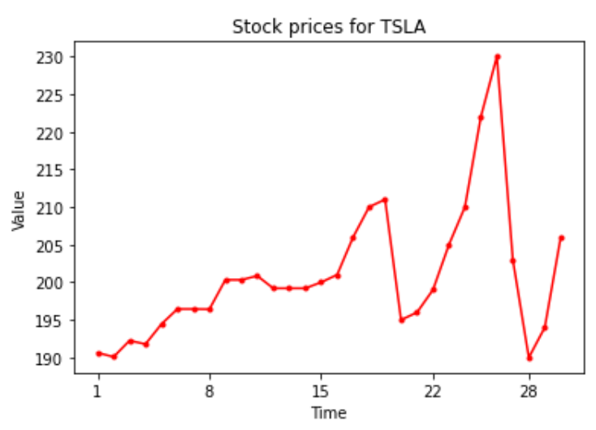
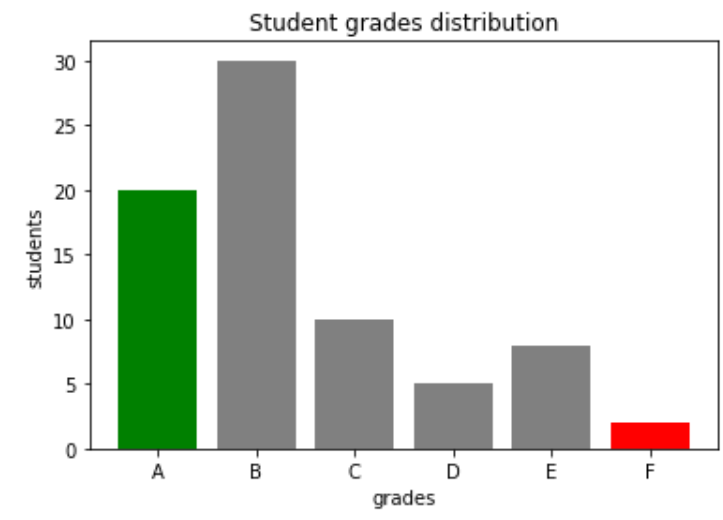
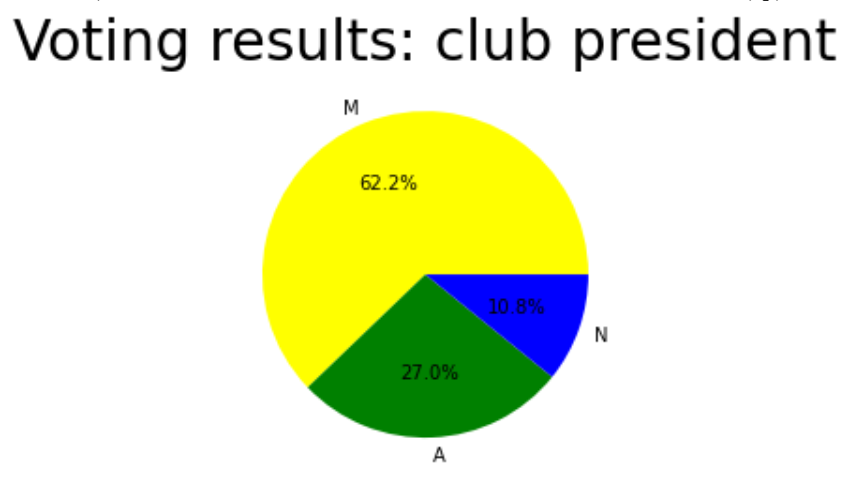
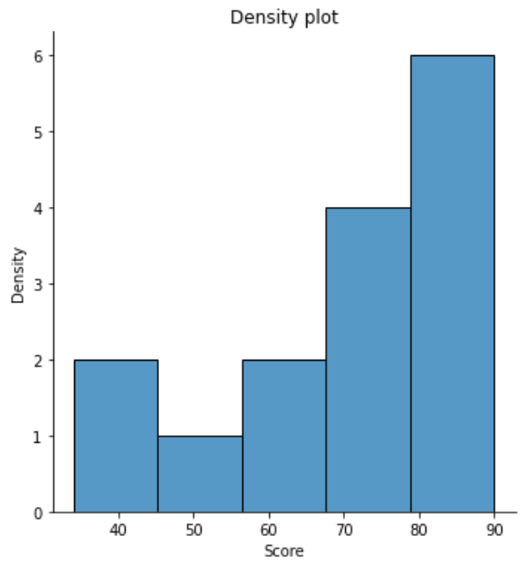
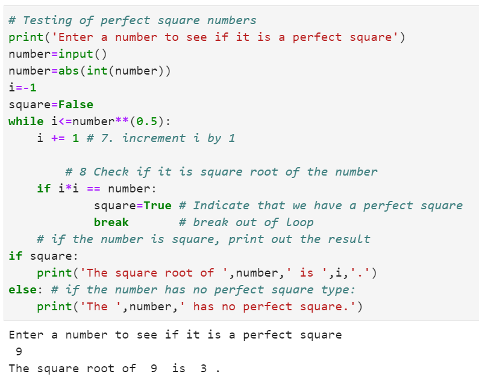

# Morten_Portfolio
Example data scienceportfolio

# [Project 1 - Data illustrating techniques](https://github.com/MortenRatzer/Morten_Portfolio/tree/main/Project%201%20-%20Data%20illustration%20techniques) 
This project includes examples of illustrations that I have created during learning sessions. 

1. Scatter plot to showcase trends of data

2. Graph to showcase stock prices

3. Bar plot to illustrate students grades

4. Piechart illustrating voting results for club president

Bar plot using Seaborn library

# [Project 2 - Test if numbers have a perfect square number](https://github.com/MortenRatzer/Morten_Portfolio/tree/main/Project%202%20-%20Test%20if%20numbers%20have%20a%20perfect%20square%20number) 
This project includes a tester I build using while loops and several if statements to see if numbers have a perfect square root.

# [Project 3 - Bidding on a house procedure](https://github.com/MortenRatzer/Morten_Portfolio/tree/main/Project%203%20-%20Bidding%20on%20a%20house%20procedure) 
This project includes a while loop to test whether a seller of a house would accept bids from the user of the code.

