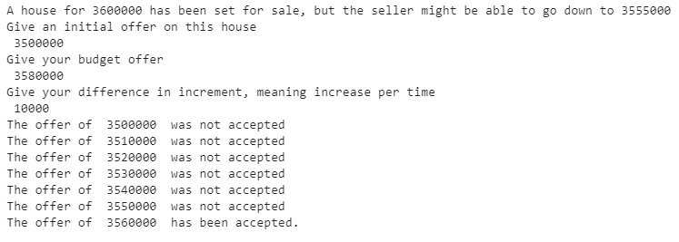
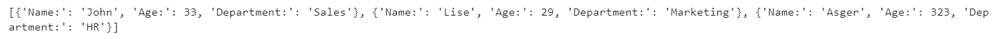
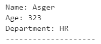

# Morten_Portfolio
The following projects are the ones I have done during training exercises with added functions as I have learned more.
I have done a Siemens Gamesa course on Python and a couple of Udemy clases where I am currently doing the 100 days of code course.

# [Project 1 - Data illustrating techniques](https://github.com/MortenRatzer/Morten_Portfolio/tree/main/Project%201%20-%20Data%20illustration%20techniques) 
This project includes examples of illustrations that I have created during learning sessions. 

1. Scatter plot to showcase trends of data

2. Graph to showcase stock prices

3. Bar plot to illustrate students grades

4. Piechart illustrating voting results for club president

5. Bar plot using Seaborn library

# [Project 2 - Test if numbers have a perfect square number](https://github.com/MortenRatzer/Morten_Portfolio/tree/main/Project%202%20-%20Test%20if%20numbers%20have%20a%20perfect%20square%20number) 
This project includes a tester I build using while loops and several if statements to see if numbers have a perfect square root.

# [Project 3 - Bidding on a house procedure](https://github.com/MortenRatzer/Morten_Portfolio/tree/main/Project%203%20-%20Bidding%20on%20a%20house%20procedure) 
This project includes a while loop to test whether a seller of a house would accept bids from a potential buyer.

# [Project 4 - Humanoid intelligence tester](https://github.com/MortenRatzer/Morten_Portfolio/tree/main/Project%204%20-%20Humanoid%20intelligence%20tester) 
This project includes a while loop to test whether a seller of a house would accept bids from the user of the code. Feel free to test your intelligens level according to this tester. 

# [Project 5 - Employee library with search function](https://github.com/MortenRatzer/Morten_Portfolio/tree/main/Project%205%20-%20Employee%20library%20with%20search%20function) 
This project includes a list of employess that needed to be sorted out. Then I added a search function to find a dear colleague.

First I made a list of employees and some variables to each colleague, being name, age, and department.

Then I printed out a better overview of the employees:

At last I made a search in the list of coleaguess for the old guy named Asger.

# [Project 6 - Time count function](https://github.com/MortenRatzer/Morten_Portfolio/tree/main/Project%206%20-%20Time%20count%20function) 
This project includes a time counter to showcase functions working over time.

# [Project 7 - Number sorting function](https://github.com/MortenRatzer/Morten_Portfolio/tree/main/Project%207%20-%20Number%20sorting%20function) 
This project includes number sorting function that can sort out a list of integers into a correct numeric order.

Input:

Output:

